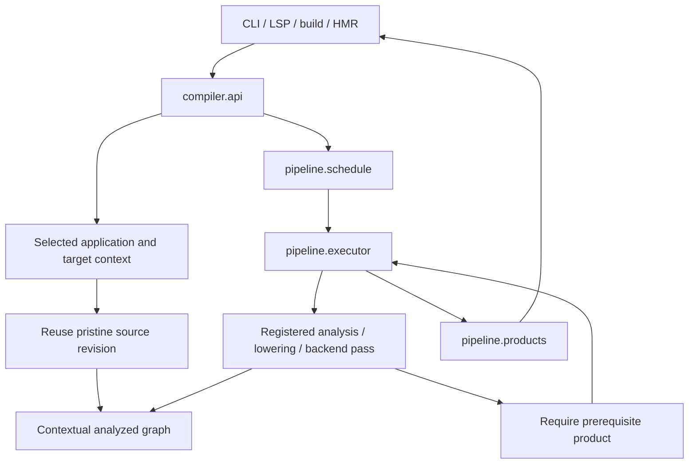
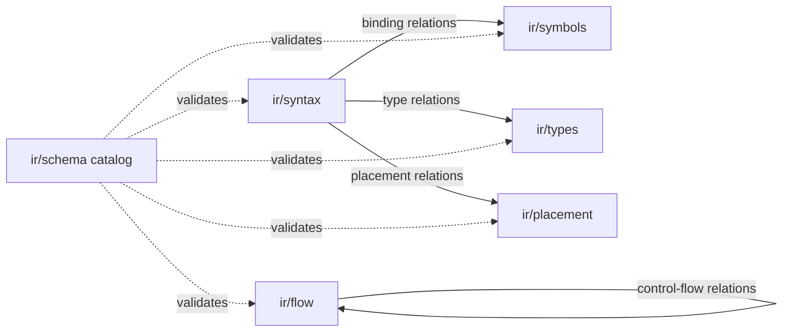

# Compiler infrastructure

Start at `api.jac` for consumer requests and `pipeline/schedule.jac` for execution
order. The graph vocabulary starts at `ir/schema.jac`. Pass implementations live
with the algorithms they execute, rather than in one flat pass directory.

| Package | Responsibility |
| --- | --- |
| `pipeline` | Typed pass/product contracts, registration, execution, progress and result ownership |
| `session` | Application and target contexts, source revisions, module loading, dependency records and persistence |
| `ir` | Shared graph schema, checked mutation and graph-derived accessors |
| `frontend` | Parsing, source positions, native parser adapter and graph materialization |
| `analysis` | Binding, placement, types, flow, memory ownership, capabilities, boundaries, interfaces and compile-time evaluation |
| `lowering` | Structural lowering, layout and MTIR |
| `backends` | Python, ES and native code generation and target artifacts |
| `bootstrap` | Compiler self-loading, catalog acquisition and native kernel scope |
| `tools` | Formatting, linting, documentation and graph inspection |
| `jaclang/build` | Application inventory and assembly/publication of prepared artifacts |

## Requests and passes

`schedule.jac` owns phase ordering, product prerequisites, pass factories and
query factories. A consumer requests a product; it does not instantiate a pass
or assemble a private list. `executor.jac` establishes diagnostic, artifact and
mutation scopes and reports progress. `products.jac` tracks task outcomes,
dependencies, versions and invalidation. `request.jac` advances a module request
through the selected schedule.

`PassIdentity`, `CompilationProduct`, `AnalysisFact`, `PassSpec` and `QuerySpec`
make the execution contract explicit. `ProductKey[T]` pairs a product identity
with its result type. Analyses receive `AnalysisServices`; application
orchestration uses `JacProgram`. Semantic service interfaces do not expose an
unrestricted compiler implementation.

## Graph domains

These are domains of one shared graph. Node declarations define capabilities;
edge declarations name their Jac endpoint types. The schema catalog derives
endpoint descriptors and adds multiplicity, ordering, lifetime and relation
family metadata. Graph identity and mutation permits live in `ir/identity.jac`.
Accessors check graph ownership and write authority before changing relations.
Their generation-tagged caches are derived views, not semantic producers.

Declaration identity reconstructed from an interface or library catalog is
persistent semantic data. `ClassDetailsShared.declaration_identity` preserves
that origin even when the catalog supplies a placeholder scope. The separate
`_identity_key` cache is only a derived view of a live declaration; clearing it
or changing unrelated type relations cannot change a catalog type's identity.

Structural role replacement checks every proposed connection before removing
the previous edges. Its validation phase uses the same typed endpoint checks
as insertion. Product cleanup also tolerates nested graph collection: a
weak-reference callback queues its removal while another sweep is active.

IR code may navigate existing structure and facts. It may not import analysis
implementations, acquire a compiler session, resolve dependencies or infer a
missing type. A property that needs new semantic work becomes a scheduled query.
Backend output belongs to the context's artifact store, not to the syntax base.

`session/sources.jac` shares pristine syntax by content revision, including
annexes. Different application or target contexts receive distinct mutable
graphs. A graph cannot be silently adopted by an unrelated session. Releasing a
context releases its products and artifacts without invalidating another
context's graph.

Application **context** selects the app's entry and boundary rules. **Placement**
describes participating codespaces. **Ownership** is reserved for memory and
borrowing analysis.

## Persistence and bootstrap

Interface and artifact codecs under `session/cache` consume prepared records.
Interface preparation belongs to `analysis/interfaces`; dependency loading
belongs to `session/imports`. Cache decoding reconstructs graph data within the
selected mutation scope and does not substitute a graph from another context.
Interface hydration restores application context without walking transitive
class references. The session resolver loads missing referenced modules through
the compilation pipeline and requests the scheduled `TypeQueryPass` when a
source class's type is missing. Catalog providers
continue to decode their recorded types without running semantic analysis.

The native parser adapter consumes the central schema and registered early-pass
bits. `jaclang/bootstrap_manifest.py` is the minimal Python seed boundary needed
before Jac imports work. Bootstrap support does not create another semantic
schedule. Native kernel runtime units are compiled in the requesting context;
their analyzed graphs are not process-global cached objects.

Known server-hosted library sources use the native early passes for symbol
imports, including imports in explicit server compilations. Each request
receives a fresh graph and its own mutation authority. Full compilation
targets, client/native imports, and nested applications keep the ordinary
source pipeline. The executor consumes early results under the same pass
contracts rather than repeating those passes in Python.

OSP records and analysis helpers live in `analysis/binding/osp_facts.jac` and
`osp_model.jac`. Scheduled ES and native passes produce separate models for
their codespaces. The runtime owns dispatch and graph operations, not compiler
analysis. Its native graph ABI uses integer object handles; native code
generation converts traversal results to language pointer lists before
iteration, filtering or field access.

The full design and acceptance requirements are in
[`docs/architecture/compiler-reorganization.md`](../../../docs/architecture/compiler-reorganization.md).

## OSP algorithms and graph storage

Declare endpoint types on the edge, then express relationships through OSP
references and connections. For example, `scope +>:ScopePrimary:+> binding`
and `binding +>:BindingTarget:+> symbol` construct a named binding;
`[scope->:ScopePrimary:->->:BindingTarget:->]` reads its symbols. Name lookup
retains a graph-derived index because repeated lookup must not scan a scope.

Connections have one commit hook on `GraphNode`, which checks relation
cardinality and mutation authority and adopts previously unclaimed nodes.
Replacement accessors preflight every proposed target before deleting existing
relations. `CollectUnclaimed` validates a reachable graph through typed walker
abilities, then its caller commits the collected claims. `ValidateGraph` also
uses an OSP traversal with an explicit visited set. These operations enforce IR
integrity; they do not perform semantic analysis or schedule compiler passes.

Semantic node handling belongs in abilities on the relevant node types.
`NativeBlockerScan`, invoked by scheduled placement work, receives candidates
from the syntax index and handles imports, abilities, root references, and
server-only constructs through typed abilities. The enclosing analysis preserves diagnostic priority
and publishes the result through the scheduled product/query infrastructure.
`ElementReferenceScan` resolves each name once to collect both references and
function escapes. Its declaration-to-element map lives only for that summary,
so a later binding or structure change cannot reuse stale associations.
`BindingFactsPass` likewise seeds typed scope/name abilities from the syntax
index, then dispatches the collected `Symbol` nodes for storage and binding
classification. It avoids a separate walk of every syntax node.
Import classification computes the module's client-context flag once per
analysis traversal, rather than rescanning the module body for each import.

`ir/syntax/cloning.jac` is the storage boundary for copying validated syntax.
It preserves endpoint types, edge ordering, and shared children while creating
fresh anchors and incoming weak references. It excludes analysis relations.
Copying assigns the destination context and clears derived state, avoiding
separate adoption and thaw traversals. Pristine source freezing and authority
assignment likewise share one checked traversal.

Runtime optimizations preserve the OSP surface: the traversal kernel caches
ordered callback plans, and the seed compiler lowers indexed first/last graph
references without allocating an intermediate list for simple transient hops.
